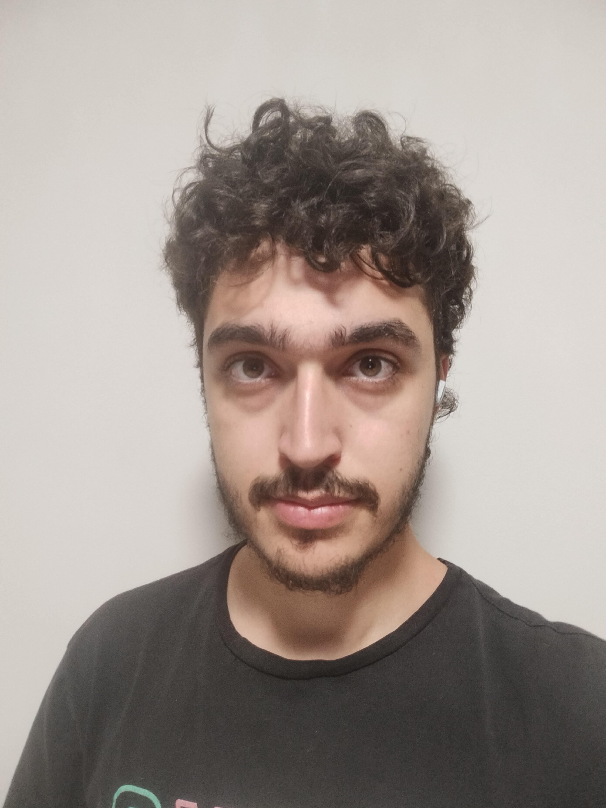
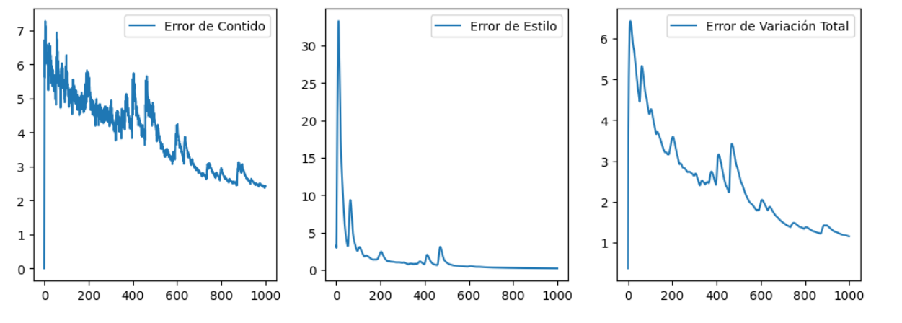
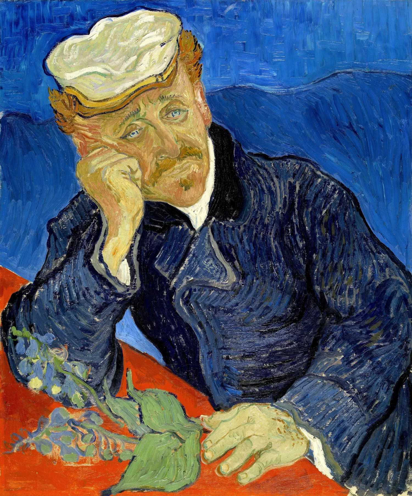
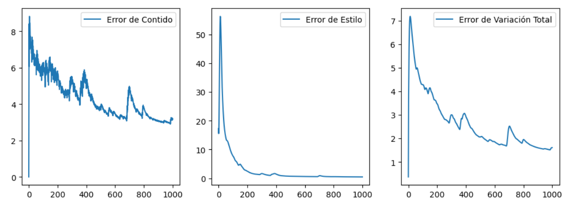
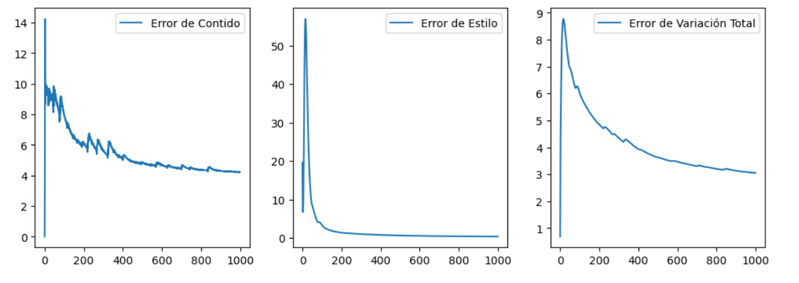
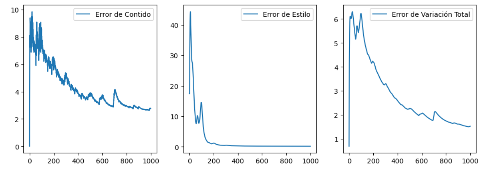

# NEURAL STYLE TRANSFER

## Description

This project is based on leveraging the feature extraction layers of pre-trained models to transfer the style from one image to the content of another, showcasing the evolution of the synthesized image during the iterations, formed only by a dataset of 2 images, thanks to the ability to access networks already trained with large-volume datasets.

## Getting Started

### Dependencies

* Operating System: Windows 10 Home 64-bit - version 21H2.
* Programming Language: Python 3.11.
* IDE: PyCharm Professional 2021.3.3
* Libraries:
  * Torch v2.0.1
  * Torchvision v0.15.2
  * Matplotlib v3.7.3
  * Pillow 10.0.0

## Author
Roi Rodríguez

## Results

### ‎ ‎ ‎ ‎ ‎ ‎ ‎ ‎ ‎ ‎ ‎ Content‎ ‎ ‎ ‎ ‎ ‎ ‎ ‎ ‎ ‎ ‎ ‎ ‎ ‎‎ ‎ ‎‎ +‎ ‎ ‎ ‎ ‎ ‎ ‎ ‎ ‎ ‎ ‎ ‎ ‎‎ ‎ ‎ ‎ ‎ ‎ ‎Style‎ ‎ ‎ ‎ ‎ ‎ ‎ ‎ ‎ ‎ ‎ ‎ ‎‎ ‎  ‎ ‎ ‎ ‎ ‎‎ ‎  ‎  ‎  =‎ ‎ ‎ ‎ ‎ ‎ ‎ ‎ ‎ ‎ ‎ ‎ ‎ Synthesized Image

  
  
  
  
  

### ‎ ‎ ‎ ‎ ‎ ‎ ‎ ‎ ‎ ‎ ‎ Content‎ ‎ ‎ ‎ ‎ ‎ ‎ ‎ ‎ ‎ ‎ ‎ ‎ ‎‎ ‎ ‎‎ +‎ ‎ ‎ ‎ ‎ ‎ ‎ ‎ ‎ ‎ ‎ ‎ ‎‎ ‎ ‎ ‎ ‎ ‎ ‎Style‎ ‎ ‎ ‎ ‎ ‎ ‎ ‎ ‎ ‎ ‎ ‎ ‎‎ ‎  ‎ ‎ ‎ ‎ ‎‎ ‎  ‎  ‎  =‎ ‎ ‎ ‎ ‎ ‎ ‎ ‎ ‎ ‎ ‎ ‎ ‎ Synthesized Image

  
  
  
  
  

### ‎ ‎ ‎ ‎ ‎ ‎ ‎ ‎ ‎ ‎ ‎ ‎ ‎ ‎ ‎ Content‎ ‎ ‎ ‎ ‎ ‎ ‎ ‎‎ ‎ ‎ ‎ ‎ ‎ ‎ ‎ ‎ ‎ ‎ ‎‎ ‎ ‎‎ +‎ ‎ ‎ ‎ ‎ ‎ ‎ ‎ ‎ ‎ ‎ ‎ ‎ ‎ ‎ ‎ ‎‎ ‎ ‎ ‎ ‎ ‎ ‎Style‎ ‎ ‎ ‎ ‎ ‎ ‎ ‎ ‎ ‎ ‎ ‎ ‎‎ ‎ ‎ ‎‎ ‎ ‎‎ ‎  ‎  ‎  =‎ ‎ ‎ 

  
  
  
  
 
### =‎ ‎ ‎ ‎ ‎ ‎ ‎ ‎ ‎ ‎‎ ‎ ‎ ‎  ‎ ‎‎ ‎ ‎ ‎ ‎ ‎ Synthesized Image

  
  

### ‎ ‎ ‎ ‎ ‎ ‎ ‎ ‎ ‎ ‎ ‎ Content‎ ‎ ‎ ‎ ‎ ‎ ‎ ‎ ‎ ‎ ‎ ‎‎ ‎ ‎‎ +‎ ‎ ‎ ‎ ‎ ‎ ‎ ‎ ‎ ‎ ‎ ‎ ‎‎ ‎ ‎ ‎ ‎ ‎ ‎Style‎ ‎ ‎ ‎ ‎ ‎ ‎ ‎ ‎ ‎ ‎ ‎ ‎‎ ‎  ‎ ‎ ‎ ‎ ‎‎ ‎  ‎  ‎  =‎ ‎ ‎ ‎ ‎ ‎ ‎ ‎ ‎ ‎ ‎ ‎ ‎ Synthesized Image

  
  
  
  
  

